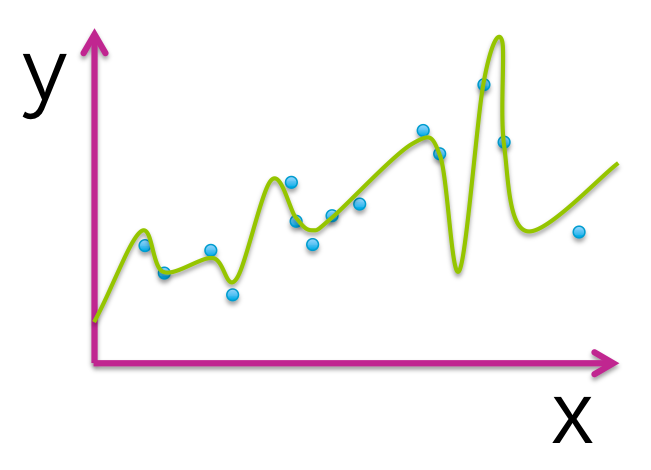
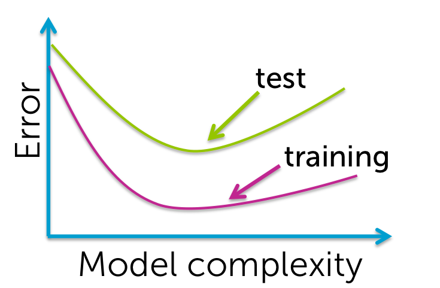

## Reqression ##

### 1. Which figure represents an overfitted model? ###

### 2. True or false: The model that best minimizes training error is the one that will perform best for the task of prediction on new data. ###

FALSE

### 3. The following table illustrates the results of evaluating 4 models with different parameter choices on some data set. Which of the following models fits this data the best? ###
| Model index | Parameters (intercept, slope) | Residual sum of squares (RSS) |
|-------------|-------------------------------|-------------------------------|
|     1       |          (0, 1.4)             |             20.51             |
|     2       |          (3.1, 1.4)           |             15.23             |
|     3       |          (2.7, 1.9)           |             13.67             |
|     4       |          (0, 2.3)             |             18.99             |

Model 3.

### 4. Assume we fit the following quadratic function: f(x) = w0+w1*x+w2*(x^2) to the dataset shown (blue circles). The fitted function is shown by the green curve in the picture below. Out of the 3 parameters of the fitted function (w0, w1, w2), which ones are estimated to be 0? (Note: you must select all parameters estimated as 0 to get the question correct.) ###
")

w2

### 5. Assume we fit the following quadratic function: f(x) = w0+w1*x+w2*(x^2) to the dataset shown (blue circles). The fitted function is shown by the green curve in the picture below. Out of the 3 parameters of the fitted function (w0, w1, w2), which ones are estimated to be 0? (Note: you must select all parameters estimated as 0 to get the question correct.) ###
")

w0 and w2

### 6. Assume we fit the following quadratic function: f(x) = w0+w1*x+w2*(x^2) to the dataset shown (blue circles). The fitted function is shown by the green curve in the picture below. Out of the 3 parameters of the fitted function (w0, w1, w2), which ones are estimated to be 0? (Note: you must select all parameters estimated as 0 to get the question correct.) ###
")

NONE

### 7. Assume we fit the following quadratic function: f(x) = w0+w1*x+w2*(x^2) to the dataset shown (blue circles). The fitted function is shown by the green curve in the picture below. Out of the 3 parameters of the fitted function (w0, w1, w2), which ones are estimated to be 0? (Note: you must select all parameters estimated as 0 to get the question correct.) ###
")

w0

### 8. Which of the following plots would you not expect to see as a plot of training and test error curves? ###

### 9. True or false: One always prefers to use a model with more features since it better captures the true underlying process. ###

FALSE

___

## Predicting house prices ##

### 1. Selection and summary statistics: We found the zip code with the highest average house price. What is the average house price of that zip code? ###

$2,160,607

### 2. Filtering data: What fraction of the houses have living space between 2000 sq.ft. and 4000 sq.ft.? ###

Between 0.4 and 0.49

### 3. Building a regression model with several more features: What is the difference in RMSE between the model trained with my_features and the one trained with advanced_features? ###

The RMSE of the model with advanced_features lower by less than $25,000