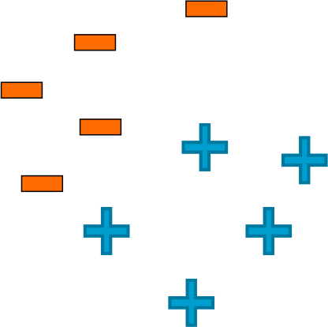

## Clasification ##

### 1. The simple threshold classifier for sentiment analysis described in the video ###

Must have pre-defined positive and negative attributes
Must either count attributes equally or pre-define weights on attributes

### 2. For a linear classifier classifying between “positive” and “negative” sentiment in a review x, Score(x) = 0 implies (check all that apply): ###

We are uncertain whether the review is “positive” or “negative”

### 3. For which of the following datasets would a linear classifier perform perfectly? ###

### 4. True or false: High classification accuracy always indicates a good classifier. ###

False

### 5. rue or false: For a classifier classifying between 5 classes, there always exists a classifier with accuracy greater than 0.18. ###

True

### 6. True or false: A false negative is always worse than a false positive. ###

False

### 7. Which of the following statements are true? (Check all that apply) ###

Test error tends to decrease with more training data until a point, and then does not change (i.e., curve flattens out)

---

