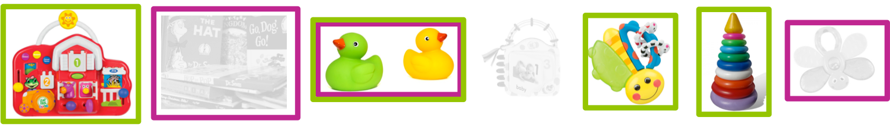
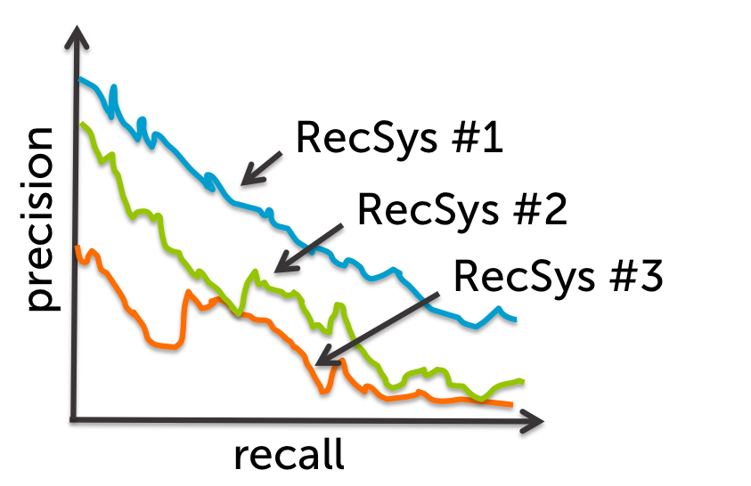

## Recommender Systems ##

### 1. Recommending items based on global popularity can (check all that apply): ###

provide personalization

capture context (e.g., time of day)

**none of the above**

### 2. Recommending items using a classification approach can (check all that apply): ###

**provide personalization**

**capture context (e.g., time of day)**

none of the above

### 3. Recommending items using a simple count based co-occurrence matrix can (check all that apply): ###

provide personalization

capture context (e.g., time of day)

**none of the above**

### 4. Recommending items using featurized matrix factorization can (check all that apply): ###

**provide personalization**

**capture context (e.g., time of day)**

none of the above

### 5. Normalizing co-occurrence matrices is used primarily to account for: ###

people who purchased many items

**items purchased by many people**

eliminating rare products

none of the above

### 6. A store has 3 customers and 3 products. Below are the learned feature vectors for each user and product. Based on this estimated model, which product would you recommend most highly to User #2? ###

| User ID |   Feature vector   |
| ------- | ------------------ |
| 1	      | (1.73, 0.01, 5.22) |
| 2	      | (0.03, 4.41, 2.05) |
| 3	      | (1.13, 0.89, 3.76) |

| Product ID |	Feature vector    |
| ---------- | ------------------ |
| 1	         | (3.29, 3.44, 3.67) |
| 2	         | (0.82, 9.71, 3.88) |
| 3	         | (8.34, 1.72, 0.02) |

Product #2

### 7. For the liked and recommended items displayed below, calculate the recall and round to 2 decimal points. (As in the lesson, green squares indicate recommended items, magenta squares are liked items. Items not recommended are grayed out for clarity.) Note: enter your answer in American decimal format (e.g. enter 0.98, not 0,98) ###

0.33

### 8. For the liked and recommended items displayed below, calculate the precision and round to 2 decimal points. (As in the lesson, green squares indicate recommended items, magenta squares are liked items. Items not recommended are grayed out for clarity.) Note: enter your answer in American decimal format (e.g. enter 0.98, not 0,98) ###

0.25

### 9. Based on the precision-recall curves in the figure below, which recommender would you use? ###

RecSys #1

---

## Recommending songs ##

### 1. Which of the artists below have had the most unique users listening to their songs? ###

Kanye West

Foo Fighters

**Taylor Swift**

Lady GaGa

### 2. Which of the artists below is the most popular artist, the one with highest total listen_count, in the data set? ###

Taylor Swift

**Kings of Leon**

Coldplay

Lady GaGa

### 3. Which of the artists below is the least popular artist, the one with smallest total listen_count, in the data set? ###

**William Tabbert**

Velvet Underground & Nico

Kanye West

The Cool Kids

