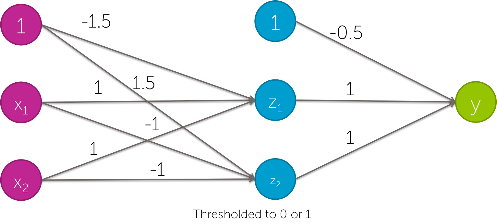

## Deep Learning ##

### 1. Which of the following statements are true? (Check all that apply) ###

Linear classifiers are never useful, because they cannot represent XOR.

Linear classifiers are useful, because, with enough data, they can represent anything.

**Having good non-linear features can allow us to learn very accurate linear classifiers.**

none of the above

### 2. A simple linear classifier can represent which of the following functions? (Check all that apply) ###

Hint: If you are stuck, see https://www.coursera.org/learn/ml-foundations/module/nqC1t/discussions/AAIUurrtEeWGphLhfbPAyQ

**x1 OR x2 OR NOT x3**

**x1 AND x2 AND NOT x3**

x1 OR (x2 AND NOT x3)

none of the above

### 3. Which of the the following neural networks can represent the following function? Select all that apply. ###

(x1 AND x2) OR (NOT x1 AND NOT x2)

Hint: If you are stuck, see https://www.coursera.org/learn/ml-foundations/module/nqC1t/discussions/AAIUurrtEeWGphLhfbPAyQ

### 4. Which of the following statements is true? (Check all that apply) ###

**Features in computer vision act like local detectors.**

Deep learning has had impact in computer vision, because it’s used to combine all the different hand-created features that already exist.

**By learning non-linear features, neural networks have allowed us to automatically learn detectors for computer vision.**

none of the above

### 5. If you have lots of images of different types of plankton labeled with their species name, and lots of computational resources, what would you expect to perform better predictions: ###

**a deep neural network trained on this data.**

a simple classifier trained on this data, using deep features as input, which were trained using ImageNet data.

### 6. If you have a few images of different types of plankton labeled with their species name, what would you expect to perform better predictions: ###

a deep neural network trained on this data.

**a simple classifier trained on this data, using deep features as input, which were trained using ImageNet data.**

---

