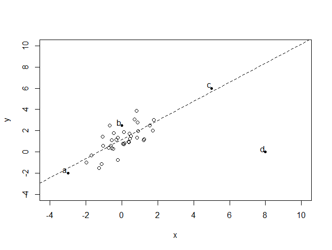

## Simple Linear Regression ##

### 1. Assume you fit a regression model to predict house prices from square feet based on a training data set consisting of houses with square feet in the range of 1000 and 2000. In which interval would we expect predictions to do best? ###

[0, 1000]

**[1000, 2000]**

[2000, 3000]

### 2. In a simple regression model, if you increase the input value by 1 then you expect the output to change by: ###

Also 1

**The value of the slope parameter**

The value of the intercept parameter

Impossible to tell

### 3. Two people present you with fits of their simple regression model for predicting house prices from square feet. You discover that the estimated intercept and slopes are exactly the same. This necessarily implies that these two people fit their models on exactly the same data set. ###

True

**False**

### 4. You have a data set consisting of the sales prices of houses in your neighborhood, with each sale time-stamped by the month and year in which the house sold. You want to predict the average value of houses in your neighborhood over time, so you fit a simple regression model with average house price as the output and the time index (in months) as the input. Based on 10 months of data, the estimated intercept is $4569 and the estimated slope is 143 ($/month). If you extrapolate this trend forward in time, at which time index (in months) do you predict that your neighborhood's value will have doubled relative to the value at month 10? (Round to the nearest month). ###

52

<pre>
	4569 + 10*143 = x    |
	                     | => y = (2*5999 - 4569)/143 = 52
	4569 + y *143 = 2*x  |
</pre>

### 5. Your friend in the U.S. gives you a simple regression fit for predicting house prices from square feet. The estimated intercept is -44850 and the estimated slope is 280.76. You believe that your housing market behaves very similarly, but houses are measured in square meters. To make predictions for inputs in square meters, what intercept must you use? Hint: there are 0.092903 square meters in 1 square foot. ###

-44850

### 6. Your friend in the U.S. gives you a simple regression fit for predicting house prices from square feet. The estimated intercept is -44850 and the estimated slope is 280.76. You believe that your housing market behaves very similarly, but houses are measured in square meters. To make predictions for inputs in square meters, what slope must you use? Hint: there are 0.092903 square meters in 1 square foot. ###

3022.07

### 7. Consider the following data set: ###

### Which bold/labeled point, if removed, will have the largest effect on the fitted regression line (dashed)? ###

a

b

c

**d**
___

## Fitting a simple linear regression model on housing data ##

### 1. Using your Slope and Intercept from predicting prices from square feet, what is the predicted price for a house with 2650 sqft? Use American-style decimals without comma separators (e.g. 300000.34), and round your answer to 2 decimal places. Do not include the dollar sign. ###

700074.85

### 2. Using the learned slope and intercept from the squarefeet model, what is the RSS for the simple linear regression using squarefeet to predict prices on TRAINING data? ###

Between 5e+12 and 5.2e+12

Between 1.1e+14 and 1.3e+14

**Between 1.1e+15 and 1.3e+15**

Between 3.3e+15 and 3.5e+15

### 3. According to the inverse regression function and the regression slope and intercept from predicting prices from square-feet, what is the estimated square-feet for a house costing $800,000? ###

3004

### 4. Which of the two models (square feet or bedrooms) has lower RSS on TEST data? ###

**Model 1 (Square feet)**

Model 2 (Bedrooms)
